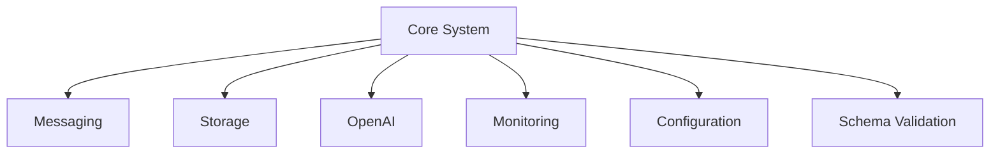

# Core System Integration & Monitoring Documentation

## System Overview

### Core Components Integration


### Key Integration Points

1. **Message Bus Integration**
- Central communication hub
- Event distribution
- Service coordination
- Message validation
- Error handling

2. **Storage Integration**
- Vector store connections
- Cache management
- Message persistence
- Data consistency

3. **OpenAI Integration**
- API management
- Rate limiting
- Response processing
- Error handling

4. **Monitoring Integration**
- Metrics collection
- Log aggregation
- Health checks
- Alert management

## Monitoring Architecture

### 1. Metrics Collection
```python
CORE_METRICS = {
    # System Metrics
    "system_cpu_usage": Gauge("system_cpu_usage_percent"),
    "system_memory_usage": Gauge("system_memory_usage_bytes"),
    
    # Application Metrics
    "request_duration": Histogram("request_duration_seconds"),
    "active_connections": Gauge("active_connections_total"),
    
    # Business Metrics
    "tasks_completed": Counter("tasks_completed_total"),
    "agent_operations": Counter("agent_operations_total")
}
```

### 2. Health Checks
```python
HEALTH_CHECKS = {
    "database": {
        "check": check_database_connection,
        "interval": 30,  # seconds
        "timeout": 5     # seconds
    },
    "openai": {
        "check": check_openai_availability,
        "interval": 60,
        "timeout": 10
    },
    "vector_store": {
        "check": check_vector_store,
        "interval": 30,
        "timeout": 5
    }
}
```

### 3. Logging Configuration
```python
LOGGING_CONFIG = {
    "version": 1,
    "handlers": {
        "console": {
            "class": "logging.StreamHandler",
            "formatter": "json"
        },
        "file": {
            "class": "logging.handlers.RotatingFileHandler",
            "filename": "logs/app.log",
            "maxBytes": 10485760,  # 10MB
            "backupCount": 5
        }
    },
    "formatters": {
        "json": {
            "()": "pythonjsonlogger.jsonlogger.JsonFormatter",
            "fmt": "%(asctime)s %(name)s %(levelname)s %(message)s"
        }
    }
}
```

## Core System Documentation

### System Architecture

1. **Base Configuration**
```python
CORE_CONFIG = {
    "environment": "production",
    "debug": False,
    "log_level": "INFO",
    "async_workers": 4,
    "max_retries": 3,
    "timeout": 30
}
```

2. **Component Dependencies**
```python
COMPONENT_DEPS = {
    "messaging": ["redis", "schema_validation"],
    "storage": ["vector_store", "cache"],
    "openai": ["rate_limiter", "monitoring"],
    "monitoring": ["metrics", "logging"]
}
```

### Integration Patterns

1. **Message Flow**
```python
async def process_system_message(message: Message):
    # Validate message
    validated = await schema_validator.validate(message)
    
    # Process message
    try:
        result = await message_processor.process(validated)
        
        # Store result
        await storage.store(result)
        
        # Update metrics
        metrics.increment(f"message_processed_{message.type}")
        
    except Exception as e:
        # Handle error
        await error_handler.handle(e)
        metrics.increment("message_processing_errors")
```

2. **Data Flow**
```python
async def handle_data_operation(data: Dict[str, Any]):
    # Validate data
    validated_data = await validate_data(data)
    
    # Process with OpenAI
    enriched_data = await openai_client.process(validated_data)
    
    # Store in vector store
    vector_id = await vector_store.store(enriched_data)
    
    # Cache results
    await cache.set(f"data:{vector_id}", enriched_data)
    
    return vector_id
```

### Error Handling

1. **Global Error Handler**
```python
class GlobalErrorHandler:
    async def handle(self, error: Exception):
        # Log error
        logger.error(f"Error occurred: {error}", exc_info=True)
        
        # Update metrics
        metrics.increment(f"error_{error.__class__.__name__}")
        
        # Notify if critical
        if is_critical_error(error):
            await notify_admin(error)
```

2. **Retry Logic**
```python
async def with_retry(operation: Callable, max_retries: int = 3):
    for attempt in range(max_retries):
        try:
            return await operation()
        except Exception as e:
            if attempt == max_retries - 1:
                raise
            await asyncio.sleep(2 ** attempt)
```

### Performance Monitoring

1. **Key Metrics**
- System resource usage
- Operation latencies
- Error rates
- Queue depths
- Cache hit rates
- API call statistics

2. **Alerting Rules**
```python
ALERT_RULES = {
    "high_error_rate": {
        "metric": "error_rate",
        "threshold": 0.05,
        "duration": "5m",
        "severity": "critical"
    },
    "high_latency": {
        "metric": "request_duration_seconds",
        "threshold": 1.0,
        "duration": "1m",
        "severity": "warning"
    }
}
```

### Best Practices

1. **System Integration**
- Use consistent error handling
- Implement proper logging
- Monitor performance metrics
- Handle backpressure
- Implement circuit breakers
- Maintain data consistency

2. **Monitoring**
- Use structured logging
- Implement proper metrics
- Set up alerting
- Monitor resource usage
- Track business metrics
- Implement tracing

3. **Performance**
- Cache frequently used data
- Use connection pooling
- Implement rate limiting
- Handle concurrent operations
- Monitor memory usage
- Optimize database queries

### Development Guidelines

1. **Code Organization**
- Follow consistent patterns
- Use dependency injection
- Implement proper interfaces
- Maintain documentation
- Write comprehensive tests

2. **Testing**
- Unit tests for components
- Integration tests for flows
- Performance tests
- Load tests
- Chaos testing

3. **Deployment**
- Use CI/CD pipelines
- Implement blue-green deployments
- Monitor deployment metrics
- Maintain rollback procedures
- Document deployment process

Remember to:
- Keep documentation updated
- Monitor system health
- Handle errors gracefully
- Maintain performance
- Follow security best practices
- Regular system maintenance

This documentation provides a high-level overview of the core system integration and monitoring. For specific implementation details, refer to the individual component documentation.
